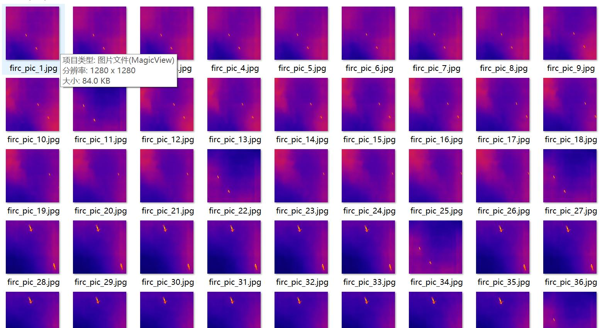
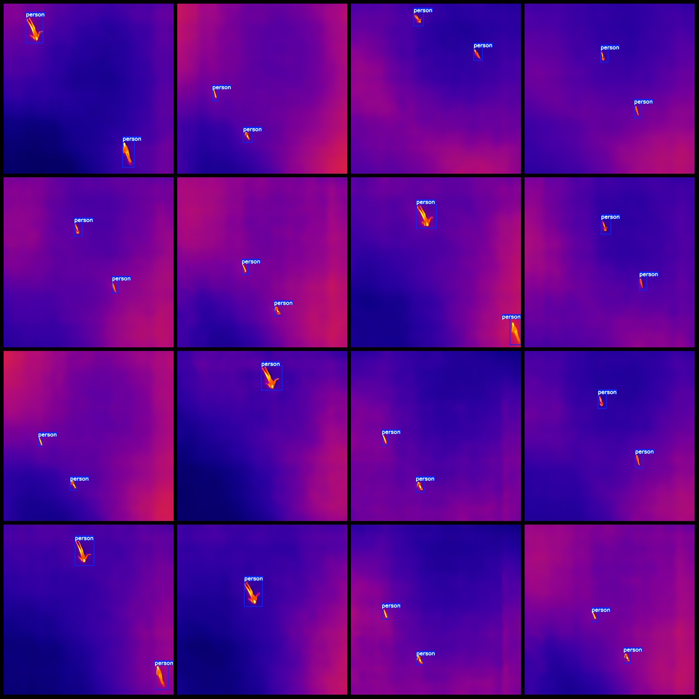
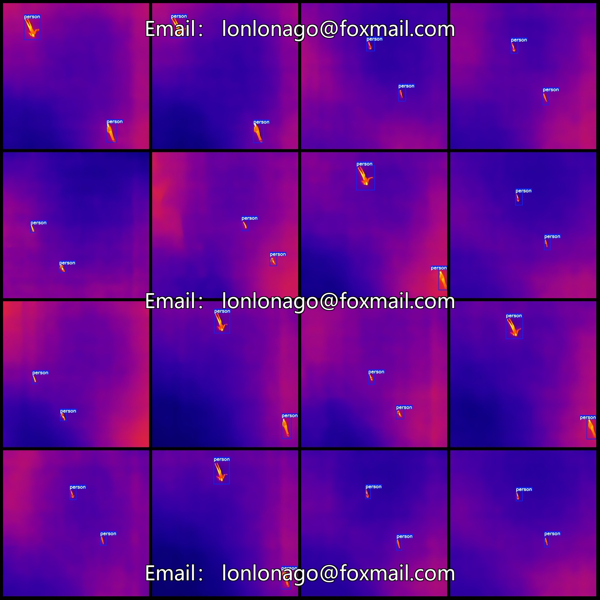

# UAV Perspective Infrared Image Sea Personnel Rescue Detection Dataset VOC+YOLO Format, 295 Categories

Dataset format: Pascal VOC format + YOLO format (txt file without segmentation paths, only containing jpg images and corresponding VOC format xml files and yolo format txt files)
Number of images (jpg file count): 295
Number of annotations (xml file count): 295
Number of annotations (txt file count): 295
Number of categories: 1
Annotation category name: ["person"]
Number of bounding box counts per category:
person = 567
Total bounding boxes: 567
Number of images per category:
person = 295
Image resolution: 1280x1280
Annotation tool used: labelImg
Annotation rules: draw rectangular bounding boxes for each category
Important note: The dataset does not have separate training, validation, or test sets; you need to divide it yourself.
Special declaration: This dataset does not guarantee the accuracy of any trained models or weight files.
Image preview:
Annotation examples:

## Images

Here is a pay link on Stripe ( https://buy.stripe.com/3cs8yP7sY87d0vu9AB ). Please contact me lonlonago@foxmail.com after funding $89, and I will send you a complete data files , thank you!

